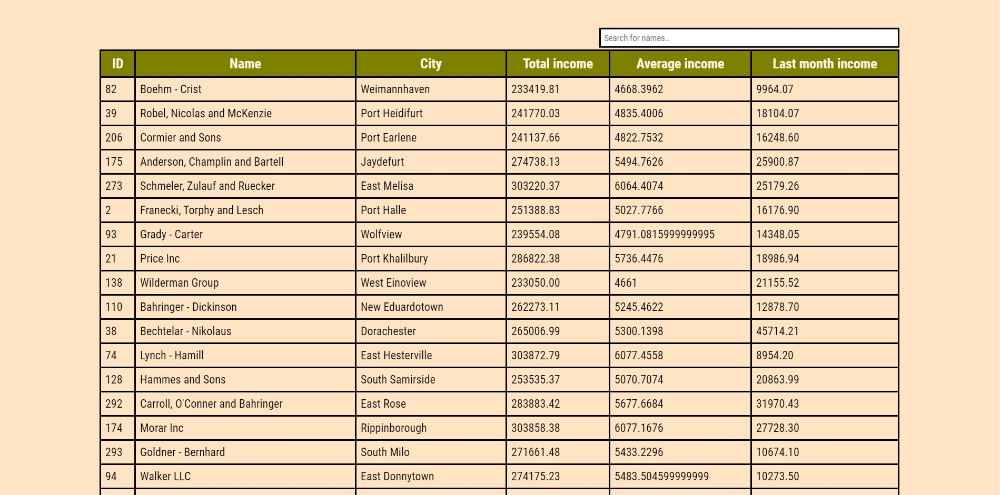

# Project Name
> Simple table of companies created with HTML, CSS(SCSS) and JavaScript!

## Table of contents
* [General info](#general-info)
* [Screenshots](#screenshots)
* [Technologies](#technologies)
* [Features](#features)
* [Contact](#contact)

## General info
This project is simple table of companies. It shows us datas of companies.

## Screenshots

## Technologies
Project is created with:

* HTML
* CSS
* JavaScript
* SCSS

## Features
List of features ready and TODOs for future development
* Check company's data
* Find company, which you are interested in
* Check company's incomes

To-do list:
* Implement the option of adding a new company

## Contact
Created by [@ChoryCzlowiek](https://github.com/ChoryCzlowiek).
